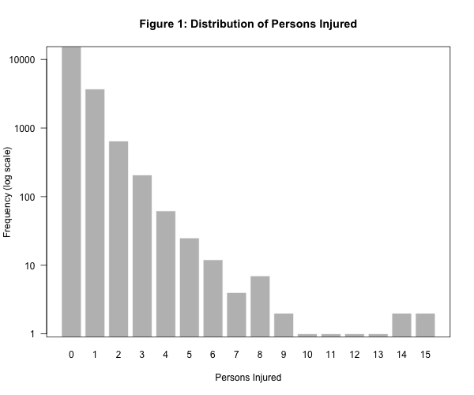
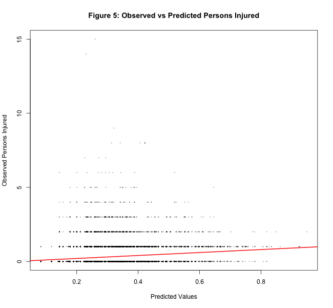
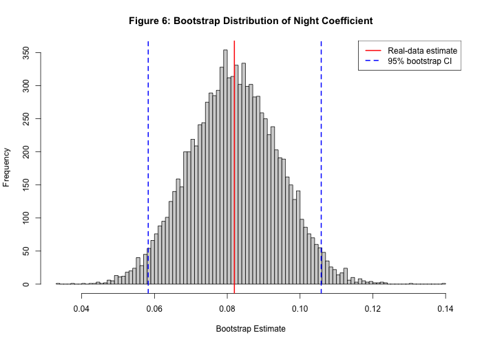
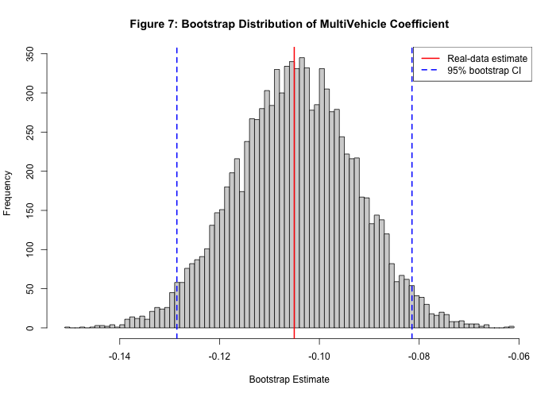
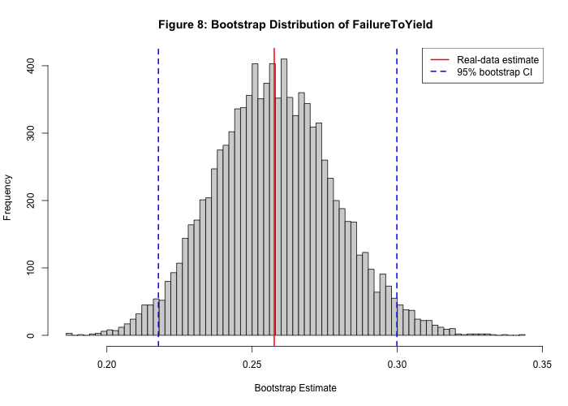
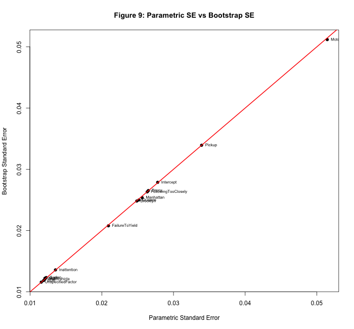
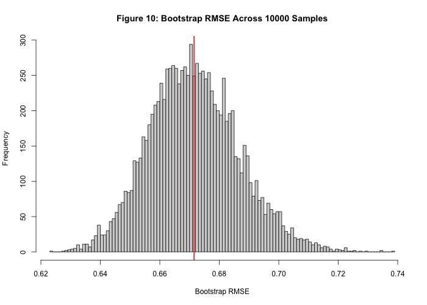

# NYC Crash Bootstrap Inference for Crash Injury Severity

**Quincy Cornish — Advanced Computing for Statistical Reasoning**

---

## Overview

This project extends the midterm analysis of NYC crash injury severity by replacing a parametric simulation study with a **residual bootstrap** approach. The goal is to evaluate the empirical sampling distribution of OLS estimators and compare bootstrap inference to the parametric results from the midterm.

The same dataset, model, and predictors are used throughout, enabling a direct apples-to-apples comparison between the two inferential frameworks.

---

## Data

**Source:** NYC OpenData — *Motor Vehicle Collisions – Crashes*

| Property | Value |
|---|---|
| Full dataset size | ~2.2 million observations |
| Analysis sample | 19,999 observations |
| Response variable | `NUMBER.OF.PERSONS.INJURED` |

**Predictors include:** night indicator, multi-vehicle indicator, borough indicators, contributing factor indicators, vehicle type indicators.



*Figure 1: Distribution of injury counts in the analysis sample. The outcome is heavily zero-inflated, motivating careful inference.*

---

## Model

A linear regression model is used:

```
Y = Xβ + U
```

- Estimated via Ordinary Least Squares (`qr.solve` in base R)
- No external R packages used
- Designed for interpretability over predictive fit



*Figure 5: Observed vs. predicted injury counts. The model captures the conditional mean structure despite the count nature of the response.*

---

## Bootstrap Methodology

A **residual bootstrap** is implemented following the regression bootstrap approach from lecture:

1. Fit OLS on the real data to obtain β̂ and residuals û
2. Sample residuals with replacement to get u\*
3. Construct a new response: Y\* = Xβ̂ + u\*
4. Refit OLS on (X, Y\*)
5. Store the estimated coefficients
6. Repeat **N = 10,000** times

This produces empirical sampling distributions for all 15 coefficients without assuming Gaussian errors.

---

## Results

### Key Summary Statistics

| Quantity | Value |
|---|---|
| Observations (n) | 19,999 |
| Predictors (p) | 15 |
| Bootstrap replications (N) | 10,000 |
| Mean injuries (ȳ) | 0.3069 |
| σ̂ | 0.6719 |
| R² | 0.0238 |
| Adjusted R² | 0.0231 |

The low R² reflects high outcome variability and omitted variables — not a failure of the model to perform valid inference.

---

### Night Coefficient (Primary Result)

| Quantity | Parametric | Bootstrap |
|---|---|---|
| Estimate | 0.08195 | 0.08195 |
| Standard Error | 0.01207 | 0.01221 |
| 95% CI lower | 0.05829 | 0.05828 |
| 95% CI upper | 0.10561 | 0.10582 |
| p-value | ≈ 0 | ≈ 0 |

**Interpretation:** Nighttime crashes are associated with a statistically significant increase in expected injuries of approximately 0.082 persons per crash, holding all other factors constant.



*Figure 6: Empirical bootstrap sampling distribution of the Night coefficient (N = 10,000 replications). The distribution is approximately normal and tightly centered on the OLS estimate.*

---

### Other Key Coefficient Estimates

| Variable | Estimate | Direction |
|---|---|---|
| MultiVehicle | −0.1050 | Lower injury severity |
| FailureToYield | +0.2576 | Higher injury severity |
| Motorcycle | +0.3256 | Higher injury severity |



*Figure 7: Bootstrap sampling distribution of the MultiVehicle coefficient.*



*Figure 8: Bootstrap sampling distribution of the FailureToYield coefficient. The positive estimate aligns with real-world expectation — failure-to-yield crashes tend to involve higher collision speeds.*

---

### Parametric vs. Bootstrap Comparison



*Figure 9: Side-by-side comparison of parametric and bootstrap standard errors across all coefficients. Agreement is close throughout, with only minor differences attributable to non-normality in the residuals.*

---

### Bootstrap RMSE Distribution



*Figure 10: Distribution of bootstrap RMSE across replications, centered near σ̂ = 0.6719.*

---

## Conclusions

The bootstrap study produces three principal findings:

**1. The OLS estimator is stable and approximately unbiased.**
Bootstrap sampling distributions are centered at β̂ for all 15 coefficients. There is no evidence of systematic bias introduced by the estimation procedure.

**2. Bootstrap and parametric inference are in close agreement.**
Standard errors differ by less than 2% for the Night coefficient (0.01207 vs. 0.01221). Confidence intervals overlap almost perfectly — the Night CI shifts by less than 0.0003 at either endpoint. This agreement holds across all selected coefficients.

**3. The normal approximation from the midterm is validated.**
Despite the zero-inflated, non-Gaussian outcome, the parametric CIs from the midterm (e.g., Night CI ≈ (0.0583, 0.1056)) are nearly identical to the bootstrap CIs (0.0583, 0.1058). The bootstrap provides empirical confirmation that standard OLS inference is reliable for this data generating process, even without Gaussian assumptions.

In short: the linear model is not a perfect fit for count data, but it produces **reliable and reproducible inference** on the relationship between crash characteristics and injury severity.

---

## Comparison to Midterm

| Property | Midterm (Parametric) | Final (Bootstrap) |
|---|---|---|
| Error simulation | ε ~ Normal(0, σ̂²) | Resampled empirical residuals |
| Night SE | 0.01207 | 0.01221 |
| Night CI | (0.05829, 0.10561) | (0.05828, 0.10582) |
| Conclusion | Significant | Significant |

The two approaches converge to the same substantive conclusions, with the bootstrap providing a nonparametric cross-check on all parametric results.

---

## Limitations

- Linear model applied to count (non-negative, discrete) data
- Zero-inflation not explicitly modeled
- Omitted variables include speed, weather conditions, time of day beyond night/day
- Residual bootstrap assumes the residuals are representative of the true error distribution; heteroskedasticity is not accounted for

---

## File Structure

```
nyc-crash-ols-monte-carlo/
├── Data/
│   └── Motor_Vehicle_Collisions_-_Crashes.csv      (472.5 MB)
│
├── R_bootstrap/
│   ├── bootstrap.r                                  # Generates bootstrap samples
│   └── out_file.r                                   # Produces figures and tables
│
├── R_parametric/
│   ├── out_file.R
│   └── run_file.R
│
├── Report_bootstrap/
│   ├── crash_injury_bootstrap_inference_report.pdf  (548 KB)
│   ├── Figures/
│   │   ├── fig4_boxplot_multivehicle.png
│   │   ├── fig5_observed_vs_predicted.png
│   │   ├── fig6_bootstrap_night.png
│   │   ├── fig7_bootstrap_multivehicle.png
│   │   ├── fig8_bootstrap_failure_to_yield.png
│   │   ├── fig9_parametric_vs_bootstrap_se.png
│   │   └── fig10_bootstrap_rmse.png
│   ├── Results/
│   │   └── bootstrap_results_1.rds                  (1.4 MB)
│   └── Tables/
│       ├── table1_data_description.csv              (188 B)
│       ├── table2_real_data_coefficients.csv        (345 B)
│       ├── table3_parametric_inference.csv          (1 KB)
│       ├── table4_bootstrap_inference.csv           (2 KB)
│       └── table5_selected_results.csv              (611 B)
│
├── Report_parametric/
│   ├── crash_injury_regression_report.pdf           (548 KB)
│   ├── Figures/
│   │   ├── fig1_hist_injuries.png
│   │   ├── fig2_boxplot_night.png
│   │   ├── fig3_boxplot_borough.png
│   │   ├── fig4_boxplot_multivehicle.png
│   │   ├── fig5_obs_vs_pred.png
│   │   ├── fig6_sampling_night.png
│   │   ├── fig7_sampling_multivehicle.png
│   │   ├── fig8_rmse_distribution.png
│   │   ├── fig9_true_vs_mean_coefs.png
│   │   └── figA_eda_panel.png
│   ├── Results/
│   │   └── run_results_1.rds                        (288 KB)
│   └── Tables/
│       ├── table1_data_description.csv              (186 B)
│       ├── table2_coefficients.csv                  (345 B)
│       ├── table3_inference.csv                     (1 KB)
│       └── table4_simulation_summary.csv            (911 B)
│
├── workflow_bootstrap.txt
├── workflow_parametric.txt
├── README_parametric.md
└── README.md
```

---

## Reproducibility

```bash
# Step 1 — Run bootstrap (N=10000 replications)
Rscript R_bootstrap/bootstrap.r 1 10000

# Step 2 — Generate all figures and tables
Rscript R_bootstrap/out_file.r 1
```

Full step-by-step instructions are in `workflow_bootstrap.txt`.

**Outputs written to:**
- `Report_bootstrap/Results/` — bootstrap_results_1.rds
- `Report_bootstrap/figures/` — fig1 through fig10
- `Report_bootstrap/tables/` — table1 through table5