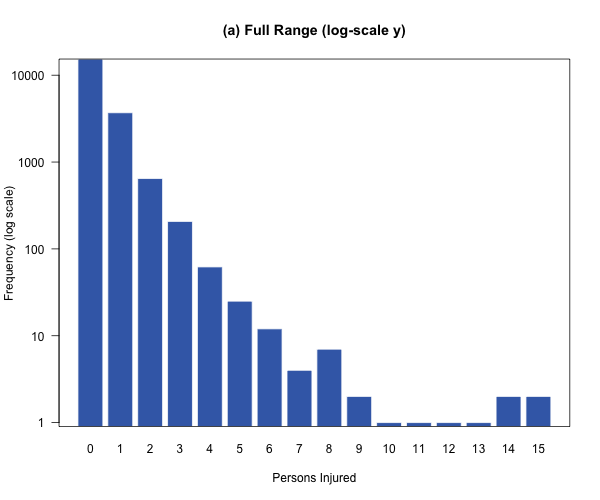
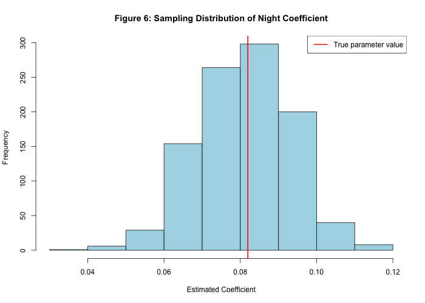

# NYC Crash Injury Severity Analysis

OLS implementation and Monte Carlo simulation analyzing factors associated with crash injury severity in New York City.

## Project Overview

This project analyzes the NYC Motor Vehicle Collisions dataset (2.2M+ observations) to estimate how crash characteristics relate to injury severity.

The analysis:

• Implements OLS regression using QR decomposition in R  
• Models number of persons injured per crash  
• Conducts a Monte Carlo simulation with 1000 replications  
• Evaluates estimator bias and sampling distributions  

## Data

Source: NYC OpenData  
Motor Vehicle Collisions – Crashes dataset.

Analysis sample: 19,999 crashes with 15 predictors.

## Repository Structure

R/  
Scripts used for model estimation and simulation

report/ 
Full project report and methodology

## Example Results

### Distribution of Crash Injuries

### Sampling Distribution of Night Coefficient

## Author
Quincy Cornish

Statistics project from coursework analyzing crash severity using regression and simulation methods.
